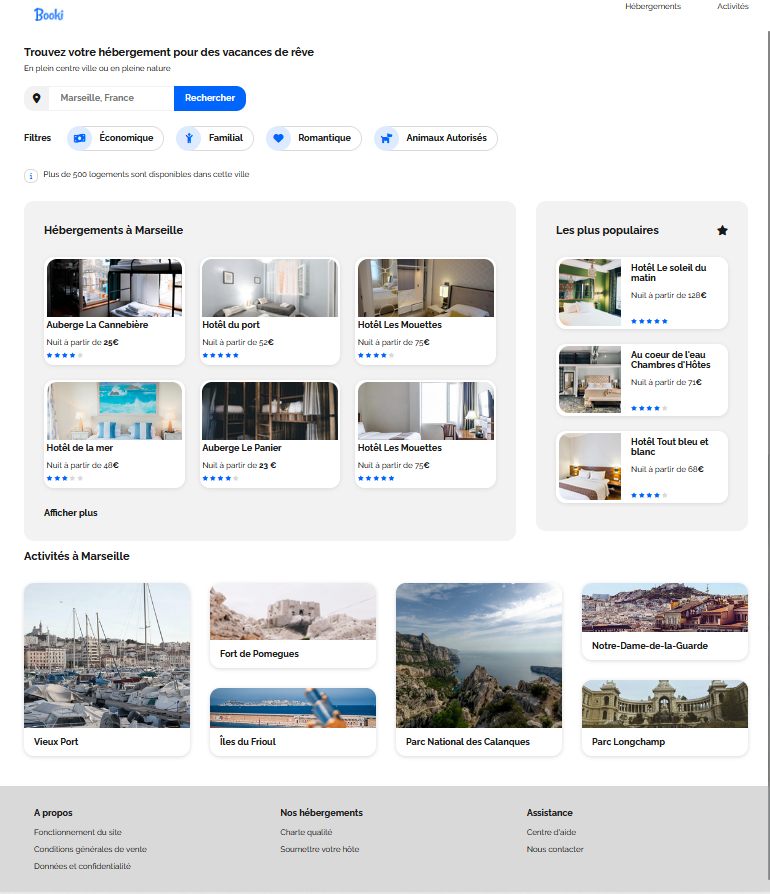

## Booki – Second project of the OpenClassrooms web-developer path

## Table of Contents
1. [General Info](#general-info)
2. [Technologies](#technologies)

### General Info
***

Booki is a vacation booking company: the objective of the project is to build a showcase one-page for the platform in responsive design (with media-queries for mobile, tablet and desktop).

The code had to be made of pure HTML5 and CSS3 without any framework (bootstrap, tailwind…) nor preprocessor (sass).

Checkout here for more details about the technical specifications and mockups of this project : 
* [technical_sepcifications]( specifications_techniques/DW+P2+-+Specifications+techniques+et+fonctionnelles.pdf)
* [mockup_desktop]( specifications_techniques/maquettes/Desktop-1.png)
* [mockup_mobile]( specifications_techniques/maquettes/iPhone8-1.png)

Checkout the URL to take a look : https://lmleopold.github.io/Booki/
### Screenshot

## Technologies
***
A list of technologies used within the project:
A list of technologies used within the project:
* : HTML5 
* : CSS3
